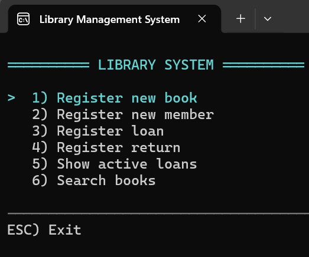

<h1 align="center">
  <b>Library (K2U2)</b>
</h1>

<p align="center">
  Console-based library management system built with C# and SQL Server<br/>
</p>

---

<table align="center">
  <tr>
    <td align="center" width="150">
      <a href="https://github.com/JotsoChas" style="color:black; text-decoration:none;">
        <p align="center">
          
          
          
        </p>
        <br/>
        <span style="font-size:16px; font-weight:bold; color:black;">Joco</span>
      </a>
    </td>
  </tr>
</table>

---

## 📘 Library system

This project is a console-based library management system that handles books, members, loans and returns.  
The system is built on a relational database where each loan connects a book to a member for a defined period.

The application includes both user workflows and an administrative menu for managing books, members and loans.  
Administrators can view active and historical loans, manage overdue loans, block or unblock members and adjust loan dates when needed.

The focus has been on correct database modeling and data integrity.  
Through transactions, indexes, views, stored procedures and application-level checks, the system ensures that invalid or unauthorized loans cannot be created.

---

## 🖥 Console application

Below is a screenshot of the console-based user interface used in the application.



---

## ⚙️ Technologies

| Component | Technology |
|----------|------------|
| Language | C# (.NET 8) |
| ORM | EF Core (Database First) |
| Database | SQL Server |
| UI | Console application |
| Version Control | GitHub |

---

## 🚀 Features

- Register books and members
- Register loans and returns
- View active and returned loans
- Search books
- Member blocking and unblocking
- Administrative menus
- Transaction handling (COMMIT / ROLLBACK)
- Indexing and execution plan analysis
- Tested concurrency handling

---

## 🗄 Database setup

The database can be installed using the full SQL export included in the repository.

Additional SQL files are also provided in the following folders for documentation and reference purposes:
- `schema/` – database schema, queries, indexes and triggers
- `views/` – database views
- `procedures/` – stored procedures

These files are **not required to run the application**.  
Running `LibraryDB_schema_and_data.sql` is sufficient to create and populate the database.

### Install the database

1. Open **SQL Server Management Studio**
2. Connect to your SQL Server instance
3. Run `LibraryDB_schema_and_data.sql`

This will create the database, tables, views, indexes and insert test data.

---

## 🔌 Connection string configuration

The application uses **EF Core (Database First)** and connects to SQL Server via `LibraryDBContext`.

By default, the project is configured to use **LocalDB**:

```
Server=(localdb)\MSSQLLocalDB;
Database=LibraryDB;
Trusted_Connection=True;
TrustServerCertificate=True;
```

Ensure that:
- SQL Server is running
- The database name is `LibraryDB`
- The connection string matches your local environment

> Note: For production use, the connection string should be moved out of source code.

---

## 📂 Full documentation

The complete technical documentation, including:
- ER diagrams
- SQL scripts
- Execution plans
- Transaction tests
- Concurrency tests
- Work log and reflections

is available here:

👉 **[Full documentation (LibraryK2U2/docs/README.md)](LibraryK2U2/docs/README.md)**

---

## 🛠 Installation

Follow these steps to download and run the project locally.

### 1. Choose a folder
- Pick or create a folder where you want to store the project files.

### 2. Open Command Prompt in that folder
- Click the address bar in File Explorer
- Type `cmd` and press Enter

### 3. Clone the repository
Repository URL:
👉 https://github.com/JotsoChas/LibraryK2U2

```
git clone https://github.com/JotsoChas/LibraryK2U2.git
```

### 4. Open the solution

- Open `LibraryK2U2.sln` in Visual Studio
- Ensure SQL Server is running
- Update the connection string if needed

### 5. Run the application

- Start the console application from Visual Studio


## 🔐 Admin login (testing)

For testing and administrative actions, a default admin account is included.

**Admin credentials:**
- Username: `admin`
- PIN: `0000`

The admin account is created automatically if it does not already exist.
This login is intended for testing and educational purposes only.

---

## 📄 License

This project was created for educational purposes.


